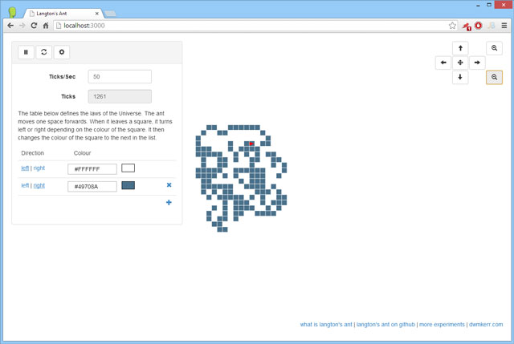
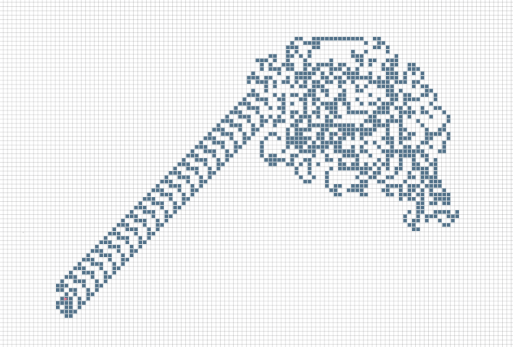
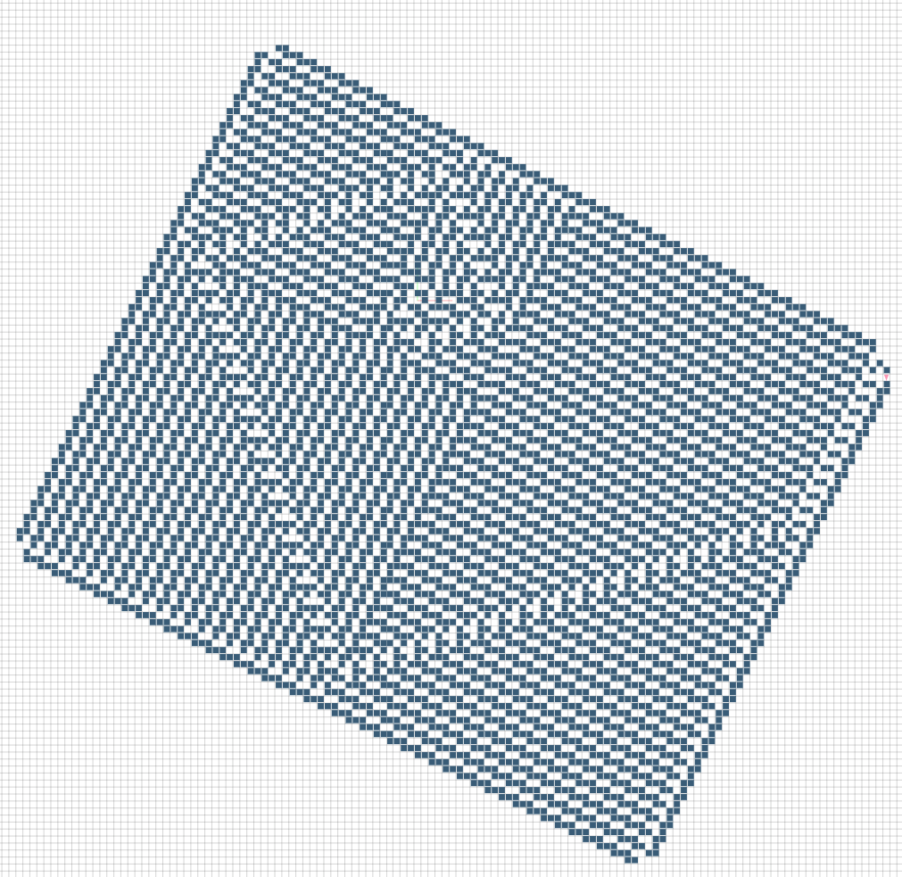
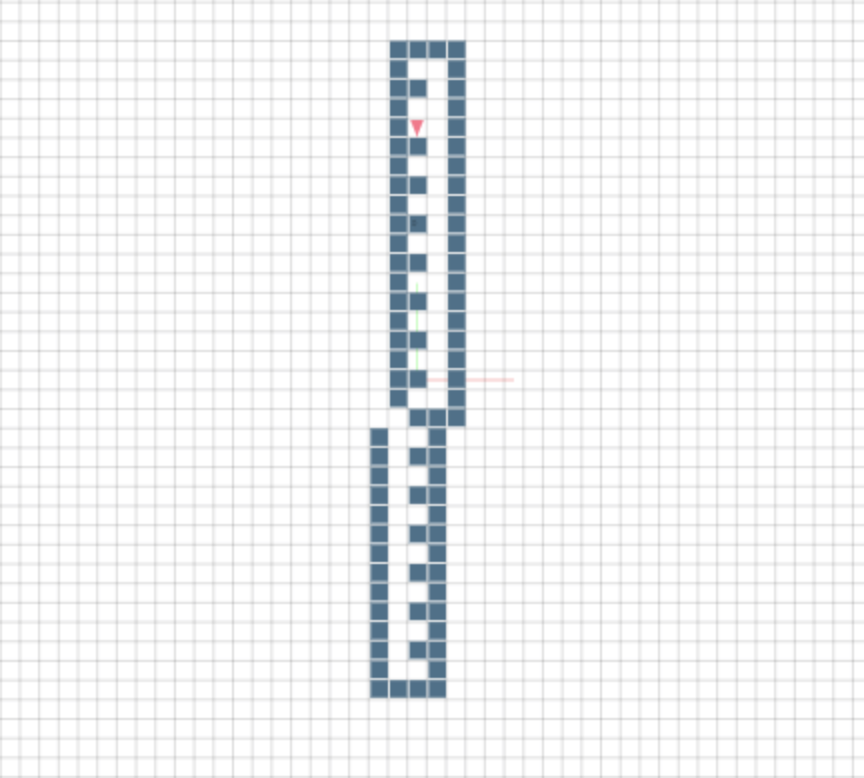
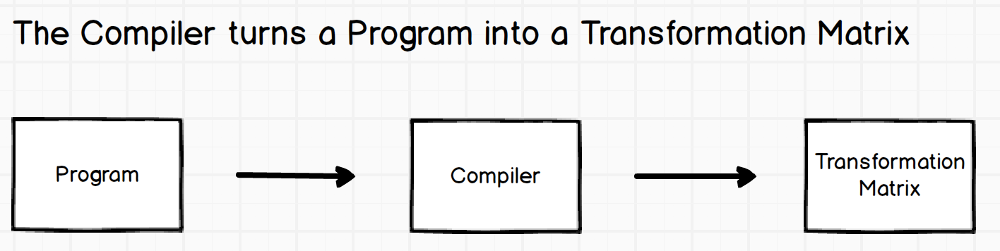
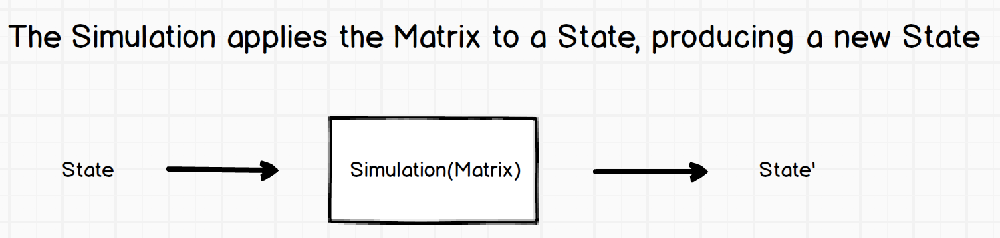
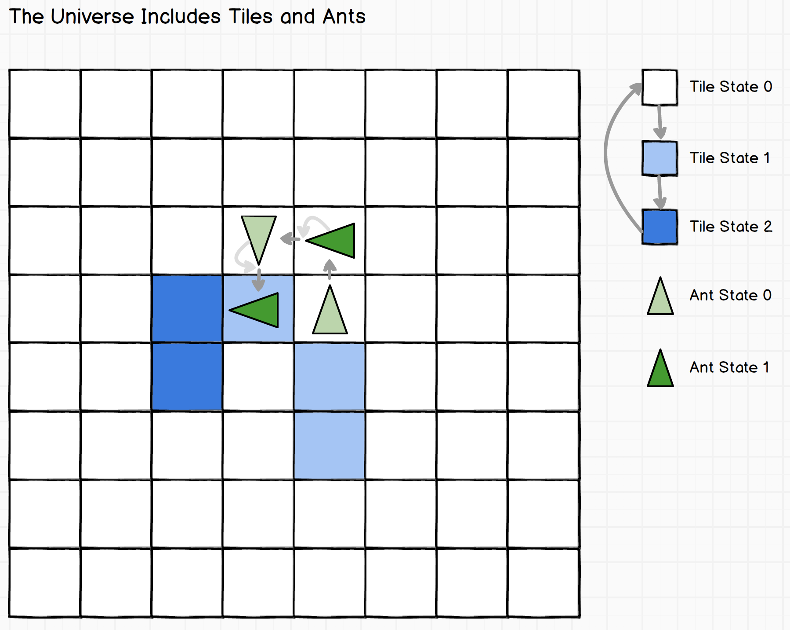

# Langton's Ant

[Langton's Ant](http://en.wikipedia.org/wiki/Langton's_ant) is a simulation which has a simple set of rules, which can produce [surprisingly complicated]() results. It is a great example of a Chaotic System, as is the case with most [Cellular Automata]().

[Try it in your browser now](http://langtonsant.com)



This project includes:

1. The core simulation engine
2. A website which can run and render the simulation
3. A specification, syntax and compiler for a simple language to express the rules of such a system

Clone the code and run:

```
npm i && npm start

```

To run the project locally, and check the [Developer Guide](#Developer-Guide) to see how to work with the code.

## Example Simulations

Some interesting example simulations are below.

<table>
  <tr>
    <th>Screenshot</th>
    <th>Description</th>
  </tr>

<tr>
  <td>
    <a href="http://www.langtonsant.com/?p=LR"></a>
  </td>
<td>
<p><strong>Langton's Ant</strong></p>
<p>
For the first few moves, shows simple patterns. Quickly becomes chaotic, then
forms a highway after about 10,000 moves.

```
LR
```

[Open In Browser](http://www.langtonsant.com/?p=LR)
</p>
</td>
</tr>

<tr>
  <td>
    <a href="http://www.langtonsant.com/?p=(1,L,1),(1,L,1);(1,R,1),(0,0,0)"></a>
  </td>
<td>
<p><strong>Fibonnaci Spiral</strong></p>
<p>
This is actually a Turmite program. It forms an ever growing Fibonacci Spiral:

```
(1,L,1),(1,L,0)
(0,R,1),(1,0,1)
```

[Open In Browser](http://www.langtonsant.com/?p=(1,L,1),(1,L,1)(1,R,1),(0,0,0))
</p>
</td>
</tr>

<tr>
  <td>
    <a href="http://www.langtonsant.com/?p=(1,0,1),(1,L,1);(0,R,1),(1,0,1)"></a>
  </td>
<td>
<p><strong>Symmetric Growing Lines</strong></p>
<p>
A pair of lines which grow forever.

```
(1, 0, 1), (1, L, 1)
(0, R, 1), (1, 0, 1)
```

[Open In Browser](http://www.langtonsant.com/?p=(1,0,1),(1,L,1);(0,R,1),(1,0,1))
</p>
</td>
</tr>

<tr>
  <td>
  </td>
<td>
<p><strong>Magic Pyramid</strong></p>
<p>
A pyramid which grows one side at a time.

```
(1, 0, 1), (0, L, 1)
(0, R, 1), (1, 0, 1)
```

[Open In Browser](http://www.langtonsant.com/?p=(1,0,1),(0,L,1);(0,R,1),(1,0,1))
</p>
</td>
</tr>

<tr>
  <td>
  </td>
<td>
<p><strong>Snail Shell</strong></p>
<p>
A snail shell.

```
(1,R,0) (0,L,1)
(0,L,1) (1,R,1)
```

[Open In Browser](http://www.langtonsant.com/?p=(1,R,0),(0,L,1);(0,L,1)(1,R,1))
</p>
</td>
</tr>

<tr>
  <td>
  </td>
<td>
<p><strong>Spiral</strong></p>
<p>
A spiral, weirdly resilient to traps, toggling tiles in the path of the ant has minor effects, but I have not been able to shake it off the spiral path, which is bizarre.

```
(1,0,1) (0,L,0)
(0,R,1) (1,0,1)
```

[Open In Browser](http://www.langtonsant.com/?p=(1,0,1) (0,L,0);(0,R,1) (1,0,1))
</p>
</td>
</tr>

</table>

## Ant Programs

Langton's Ant is a trivial example of a [Turmite](). To allow different configurations to easily be conastructed and shared, I have defined a syntax for a 'program'. A program is simply the set of rules for the system.

The program syntax is designed to make it easy to express the rules of the system with plain text, in a readable format:



The simulation applies the rules of the matrix to a given state, producting a new state.



An interface is layered on top. It renders the state, runs the simulation and provides controls to configures parameters.

### The Transformation Matrix

Before understanding how a program works, it is important to understand the transformation matrix.

The transformation matrix is the complete set of rules for a turmite or ant simulation. The universe looks like this:



An _element_ of the transformation defines that when the ant is in a given *ant state* and on a tile with a given *tile state*, what *ant direction change* will be made, and what *tile state change* will occur on the tile the ant leaves. This is a three-tuple:

```
(Ant State Change, Ant Direction Change, Tile State Change)
```

For example:

- `(1, 90, 0)`: Ant State increases `1`, Ant turns `90` clockwise, Tile State increases `0`
- `(0, -90, 1)`: Ant State increases `0`, Ant turns `90` counter-clockwise, Tile State increases `1`

The _Transformation Matrix_ is the complete set of state transformations which are required to define a complete set of rules.

For example:

```
|      | T: 0      | T: 1      |
|------|-----------|-----------|
| a: 0 | (1,-90,1) | (1,-90,0) |
| a: 1 | (0,90,1)  | (0,0,1)   |
```

In this matrix (which defines a Fibonacci Spiral Turmite) we see the transformations which are applied for every combination of ant state and tile state.

### Program Syntax

A program is just a represenation of each element in the matrix. For example, the spiral matrix above can be written as:

```
(1,-90,1) (1,-90,0)
(0,90,1)  (0,0,1)
```

One of the goals of this project is to facilitate the easy sharing of this matrix. Readability and compactness are important. The compiler which builds the matrix from the input follows the following rules:

0. If the program only contains `L` or `R` characters, it is expanded from shorthand, as described in the section on [Shorthand Ant Transformation Matrices](#Shorthand-Ant-Programs)
0. Any semi-colon is converted into a newline (allowing a program to be written on a single line if needed
1. All whitespace is eliminated, except the newline at the end of each row
1. Commmas are optional between tuples
4. If the matrix is not rectangular, there are an incorrect number of tuples, an error is thrown

The compiler itself can be used with the following code:

```js
const { compiler } = require('langtonsant');

const input = `
  (1, L, 1) (1, L, 1)
  (1, R, 1) (0, 0, 0)
`;

const matrix = compiler(input);

console.log(matrix);
// TODO
```

### Shorthand Ant Programs

The Langton's Ant transformation matix is just a trivial form of a Turmite transformation matrix. An Ant is a Turmite which only has one state.

An ant program can be expressed using the full syntax above, or in a more compact form, composed just of `L`s and `R`s, e.g:

```
LLRL
```

Which is just shorthand for the following matrix:

```
|      | T: 0        | T: 1        | T: 2        | T: 3        |
|------|-------------|-------------|-------------|-------------|
| a: 0 | (0, -90, 1) | (0, -90, 1) | (0, +90, 1) | (0, -90, 1) |

i.e.          L             L             R             L
```

## Developing

### Running the Code

Just clone the repo, then run:

```
npm install && npm start
```

To install dependencies and run the simulation in development mode.

### Deploying the Code

To build the distribution, run:

```
make build
```

To deploy to AWS, run:

```
make deploy
```

This command will require permissions to the `langtonsant.com` S3 bucket.

### CI/CD

There is a simple CI/CD pipeline for this project:

1. All commits build, test and lint on CircleCI 2.0
2. Any commit to master will be built. If tests pass, it will automatically deploy to www.langtonsant.com
3. Pushing a semver tag will trigger a publish to NPM

Bump the version with `npm run release`.

## Url Parameters

A set of parameters can be provided in the url.

| Parameter | Usage |
|-----------|-------|
| `p`       | The program string, e.g. `LLRL`. |

## References

Very useful information came from:

- [https://github.com/rm-hull/turmites](https://github.com/rm-hull/turmites)
